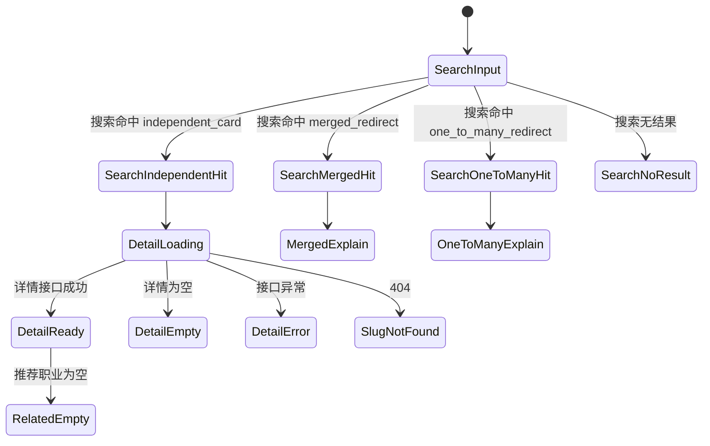

# AIRS 中国职业层页面状态机

## 适用范围

- 本期上线范围只有 P0 18 个独立建卡页面。
- 但状态机必须覆盖未来会出现的 `merged_redirect` 和 `one_to_many_redirect`，避免后续返工。

## 总体流程

## 状态说明

| 状态 | 触发条件 | 页面表现 | 回退策略 | 埋点建议 |
| --- | --- | --- | --- | --- |
| 搜索命中独立建卡 | 搜索接口返回 `mapping_type = independent_card` | 搜索结果显示中国职业卡片，点击进入 `/china-occupations/:slug` | 若详情失败，进入对应详情异常态 | `china_search_hit`、`china_search_result_click` |
| 搜索命中 merged_redirect | 搜索接口返回 `mapping_type = merged_redirect` | 展示映射说明页或说明弹层，主按钮跳 AIRS 主职业 | 若 parent 不存在，退回搜索无结果态并记录异常 | `china_search_hit_merged`、`china_mapping_view`、`china_parent_click` |
| 搜索命中 one_to_many_redirect | 搜索接口返回 `mapping_type = one_to_many_redirect` | 展示分流页，列出 2-3 个推荐 AIRS 去向 | 若无可用去向，退回搜索无结果态并提示稍后再试 | `china_search_hit_one_to_many`、`china_mapping_view`、`china_split_target_click` |
| 搜索无结果 | 搜索接口返回空数组 | 展示“未找到中国职业结果”提示，并给 AIRS 搜索入口或热门 P0 推荐 | 保留原查询词，允许继续搜 AIRS | `china_search_zero_result` |
| 职业详情加载中 | 进入详情路由且接口尚未返回 | 展示骨架屏，保留标题区占位和 9 模块占位顺序 | 超时后进入详情异常态 | `china_detail_loading` |
| 职业详情为空 | 接口返回 200，但关键字段缺失或状态不可展示 | 展示空态提示：“该职业内容尚未准备好” | 提供返回搜索页和热门 P0 入口 | `china_detail_empty` |
| 职业详情异常 | 接口 5xx、网络失败、解析失败 | 展示错误提示、重试按钮、返回搜索页入口 | 用户可重试；仍失败则回搜索页 | `china_detail_error`、`china_detail_retry` |
| 推荐职业为空 | 详情页成功，但推荐接口返回空数组 | 页面隐藏相关推荐列表，或替换为“热门中国职业”兜底区 | 优先用热门 P0 兜底；若不做兜底则直接省略模块内容 | `china_related_empty` |
| slug 不存在 | 详情接口返回 404 | 展示 404 页面，文案指向中国职业搜索 | 提供搜索框、热门 P0 列表、返回首页 | `china_detail_404` |

## 状态细化

### 1. 搜索命中独立建卡

- 触发条件：`GET /api/china-occupations/search` 命中一条 `mapping_type = independent_card` 的记录。
- 页面表现：结果卡片展示中文标题、英文副标题、短文案、方向标签、父职业关系摘要。
- 回退策略：点击进入详情后若接口失败，前端统一落到“职业详情异常”状态，不回退到 AIRS 主职业页。
- 埋点建议：记录查询词、命中方式（主名/别名/模糊）、点击的 slug 和顺位。

### 2. 搜索命中 merged_redirect

- 触发条件：搜索结果返回 `mapping_type = merged_redirect`。
- 页面表现：先给映射说明，再提供“查看相关 AIRS 主职业”按钮。
- 回退策略：若 parent 为空，前端不应直接跳空链接，而应退到“搜索无结果”并给热门中国职业列表。
- 埋点建议：记录用户是否查看了映射说明、是否点击 AIRS 主职业按钮。

### 3. 搜索命中 one_to_many_redirect

- 触发条件：搜索结果返回 `mapping_type = one_to_many_redirect`。
- 页面表现：展示“该中国职业对应多个 AIRS 主职业”的说明，并列出候选去向。
- 回退策略：若候选列表为空，退回搜索无结果态。
- 埋点建议：记录用户最终选择了哪个目标职业。

### 4. 搜索无结果

- 触发条件：搜索接口空数组，或搜索接口异常后前端主动兜底。
- 页面表现：提示“未找到对应中国职业”，保留原查询词，并展示 AIRS 搜索入口和热门 P0 推荐。
- 回退策略：允许用户一键切换到 AIRS 主职业搜索。
- 埋点建议：记录原查询词、是否转去 AIRS 搜索、是否点击热门推荐。

### 5. 职业详情加载中

- 触发条件：进入详情页后，详情接口 pending。
- 页面表现：显示骨架屏，不展示空白区域。
- 回退策略：超过超时阈值后进入异常态。
- 埋点建议：记录接口耗时、页面首次可见时间。

### 6. 职业详情为空

- 触发条件：接口成功返回，但关键字段缺失，如 `cn_title_display`、`intro_short`、`mapping_type` 为空，或 `status != ready/online`。
- 页面表现：展示内容未准备好的空态文案。
- 回退策略：返回搜索页，或展示热门 P0 推荐。
- 埋点建议：记录缺失字段名和 slug，便于内容修复。

### 7. 职业详情异常

- 触发条件：接口 5xx、网络失败、解析失败。
- 页面表现：错误提示 + 重试按钮 + 返回搜索页。
- 回退策略：用户可重试；如果连续失败，建议回到搜索页。
- 埋点建议：记录错误码、slug、重试次数。

### 8. 推荐职业为空

- 触发条件：相关推荐接口返回空数组。
- 页面表现：相关推荐模块可以显示空标题但不渲染卡片，或直接替换成热门 P0 模块。
- 回退策略：优先兜底到热门 P0，若不做兜底则整块隐藏。
- 埋点建议：记录哪个 slug 触发了推荐为空。

### 9. slug 不存在

- 触发条件：详情接口返回 404。
- 页面表现：展示“页面不存在或已下线”，附带中国职业搜索框和热门 P0 列表。
- 回退策略：允许用户直接回搜索页或首页。
- 埋点建议：记录 404 slug 和来源页面。

## 本期上线约束

- 本期正式数据只有 `independent_card`，因此 merged 和 one-to-many 主要是接口预留和状态预留。
- 详情页必须覆盖 loading、404、error、相关推荐为空四个真实可发生状态。
- 无父职业的页面不能显示空按钮；应明确写“当前暂无稳妥的 AIRS 主职业可直接挂靠”。
